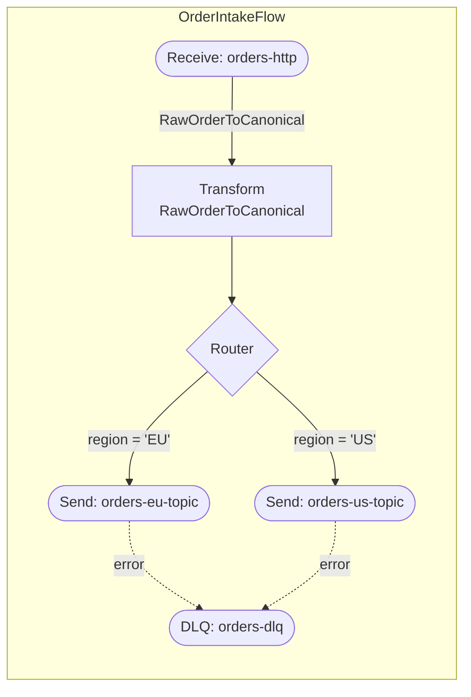

Render `integration-ir.yaml` flows as Mermaid diagrams.

## Steps

1. Resolve the integration folder (argument or most recently modified `specs/*/*/`).
2. Read `integration-ir.yaml`. If it does not exist, stop and instruct the user to run `/architect` first.
3. For each flow in `flows[]`, generate a Mermaid `flowchart TD` subgraph following the **Rendering rules** below.
4. Combine all subgraphs into a single fenced Mermaid code block.
5. Create or overwrite `docs/generated/flows.md` in the repo root with the content below.
6. Print: `Rendered N flow(s) → docs/generated/flows.md`.

## Rendering rules

### Nodes

| IR step type | Mermaid shape | Label |
|---|---|---|
| `receive` | `([Receive: <channel>])` — stadium | channel name |
| `transform` | `[Transform\n<mappingRef>]` — rectangle | mapping name on second line |
| `enrich` | `[Enrich\n<mappingRef or dependency>]` | |
| `filter` | `{Filter\n<predicate excerpt>}` — rhombus | first 40 chars of predicate |
| `router` | `{Router}` | one diamond per route |
| `recipientList` | `[Recipient List]` | |
| `splitter` | `[Splitter]` | |
| `aggregator` | `[Aggregator\n<correlation key>]` | |
| `scatterGather` | `[Scatter-Gather]` | |
| `send` | `([Send: <channel>])` — stadium | channel name |
| `invoke` | `[Invoke: <dependency>\ntimeout: <timeout>]` | |

### Edges

- Normal `next` → solid arrow `-->`.
- Router `routes[].when` → labelled arrow `--> |<predicate excerpt>|`.
- Router `default: true` → labelled arrow `--> |default|`.
- `onError` / DLQ branch → dashed arrow `-.->` with label `DLQ`.

### DLQ terminals

When a flow has `errorHandling.dlq`, add a terminal node:

```
DLQ_<FlowName>([DLQ: <dlq.channel>])
```

Connect it from every `send` and `invoke` step with a dashed arrow: `-. error .->`.

### Subgraph wrapper

```
subgraph <FlowName>
  direction TD
  ...nodes and edges...
end
```

### Mapping reference labels

On every `transform`/`enrich` edge leading out of the step, append `|<mappingRef>|` to the arrow label so the mapping name is visible on the diagram without opening the IR.

## Output file (`docs/generated/flows.md`)

```markdown
# Integration Flows

Generated from `<spec-folder>/integration-ir.yaml` on <ISO-8601>.
Do not edit manually — re-run `/visualize` to regenerate.


```

## Rules

- Node ids must be valid Mermaid identifiers (alphanumeric + underscore; prefix with step type + `_` + position index if the id contains hyphens).
- Truncate predicate labels to 40 characters; append `…` if truncated.
- If a flow has no steps, emit a single placeholder node: `empty([No steps])`.
